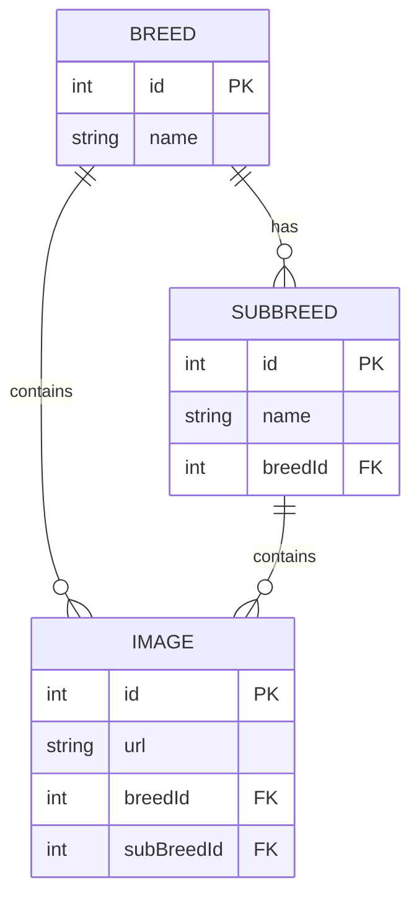

# Dog API Project - Java Console Application with MySQL Database

A comprehensive Java console application that integrates with the Dog API to fetch and manage dog breeds, sub-breeds, and images. This project demonstrates API integration, database operations, and data persistence using MySQL, providing a complete solution for dog breed information management.

## 🚀 Features

- **Dog API Integration**: Seamlessly fetch all breeds, sub-breeds, and images from the Dog API.
- **Local Database Operations**: Full CRUD operations for breed, sub-breed, and image data in a local MySQL database.
- **Duplicate Prevention**: Intelligent data saving from API to database while avoiding duplicates.
- **Console-Based Interface**: Intuitive menu-driven interface for all operations.
- **Java 24 & Maven**: Built with modern Java and Maven for dependency management.

## �️ Technologies Used

This project is built using the following technologies and programming languages:

### Programming Language
- **Java 24**: The core programming language used for developing the application. Java provides object-oriented programming capabilities, platform independence, and robust standard libraries for building console applications.

### Build Tool
- **Apache Maven**: A powerful project management and build automation tool used for:
  - Dependency management
  - Project structure standardization
  - Compilation and packaging
  - Running tests and the application

### Database
- **MySQL**: A popular open-source relational database management system used for:
  - Storing dog breed, sub-breed, and image data
  - Performing CRUD operations
  - Ensuring data persistence and integrity

### Libraries and Frameworks
- **MySQL Connector/J**: JDBC driver for connecting Java applications to MySQL databases
- **JSON Library**: For parsing and handling JSON responses from the Dog API

### Development Tools
- **Git**: Version control system for tracking changes and collaboration
- **GitHub**: Platform for hosting the repository and version control

### Architecture Patterns
- **DAO (Data Access Object)**: Pattern used for separating data access logic from business logic
- **Service Layer**: Contains business logic and orchestrates operations between DAO and API services
- **MVC-like Structure**: Organized code into Model (data), View (console output), and Controller (Main class) components

## �📋 Prerequisites

- Java 24 or higher
- Maven 3.6 or higher
- MySQL Server 8.0 or higher
- Internet connection (for API calls)

## 🛠️ Installation and Setup

1. **Clone the repository**:

   ```bash
   git clone https://github.com/roshaniist/DogApiusingSpringboot.git
   cd dogApiProject2
   ```

2. **Set up the database**:
   - Install and start MySQL Server.
   - Create a database named `dogdb`:
     ```sql
     CREATE DATABASE dogdb;
     ```
   - Update the database credentials in `src/main/resources/db.properties` if necessary:
     ```
     db.url=jdbc:mysql://localhost:3306/dogdb
     db.username=your_username
     db.password=your_password
     ```

3. **Build the project**:
   ```bash
   mvn clean compile
   ```

## 🎯 Usage

1. **Run the application**:

   ```bash
   mvn exec:java -Dexec.mainClass="org.example.dogApi.Main"
   ```

2. **Main Menu Options**:
   - **Access Dog API**: Fetch data directly from the Dog API.
     - List all breeds
     - List all sub-breeds
     - List sub-breeds of a specific breed
     - Get random images
     - Get images by breed or sub-breed
   - **Local DB Operations**: Manage data in the local MySQL database.
     - View, add, update, delete breeds, sub-breeds, and images
   - **Save to Local DB**: Transfer data from the API to the database without duplicates.

## 🗂️ Project Structure

```
src/
├── main/
│   ├── java/
│   │   └── org/example/dogApi/
│   │       ├── Main.java                    # Main application class
│   │       ├── dao/                         # Data Access Objects
│   │       │   ├── BreedDAO.java
│   │       │   ├── ImageDAO.java
│   │       │   └── SubBreedDAO.java
│   │       ├── model/                       # Data models
│   │       │   ├── Breed.java
│   │       │   ├── Image.java
│   │       │   └── SubBreed.java
│   │       ├── service/                     # Business logic services
│   │       │   ├── DogApiService.java
│   │       │   ├── LocalDbService.java
│   │       │   └── SaveToLocalDbService.java
│   │       └── util/                        # Utilities
│   │           └── DBConnection.java
│   └── resources/
│       └── db.properties                    # Database configuration
└── test/
    └── java/                                # Unit tests
```

## 🗄️ Database Schema

The application uses a MySQL database with the following entity-relationship diagram:



### Relationships:

- **Breed to SubBreed**: One-to-many (a breed can have multiple sub-breeds)
- **Breed to Image**: One-to-many (a breed can have multiple images)
- **SubBreed to Image**: One-to-many (a sub-breed can have multiple images)

## 📦 Dependencies

- **MySQL Connector/J**: For database connectivity
- **JSON**: For parsing API responses

## 🔗 API Reference

This application uses the [Dog API](https://dog.ceo/dog-api/) for fetching dog breed information. The Dog API provides a free REST API for dog images and breed data.

## Testing

Run tests using Maven:

```bash
mvn test
```

## Contributing

1. Fork the repository
2. Create a feature branch
3. Commit your changes
4. Push to the branch
5. Create a Pull Request

## License

This project is licensed under the MIT License - see the LICENSE file for details.
